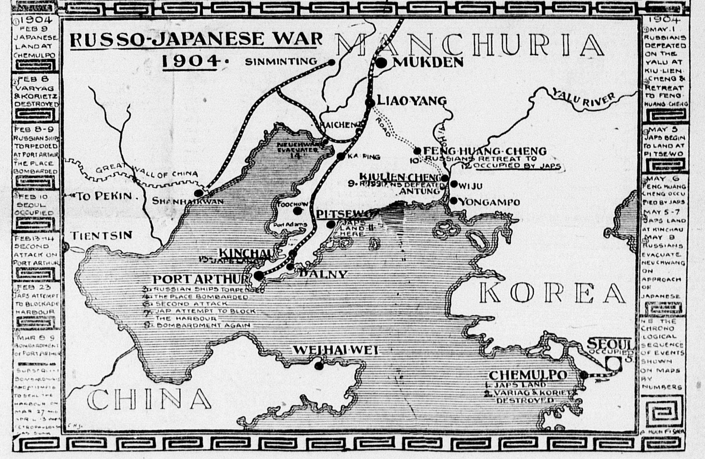
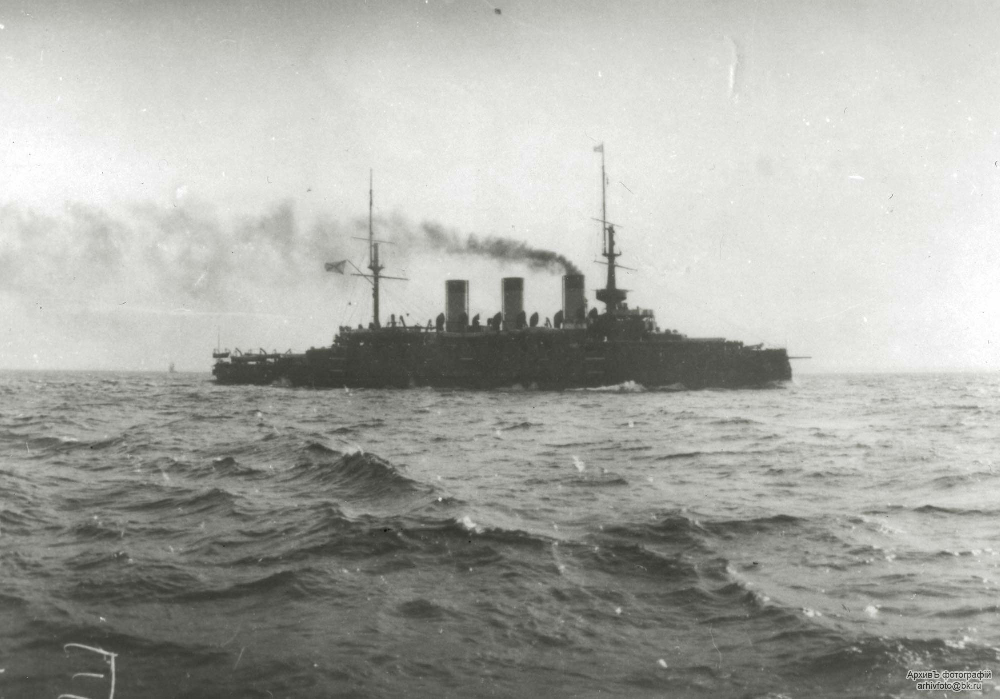
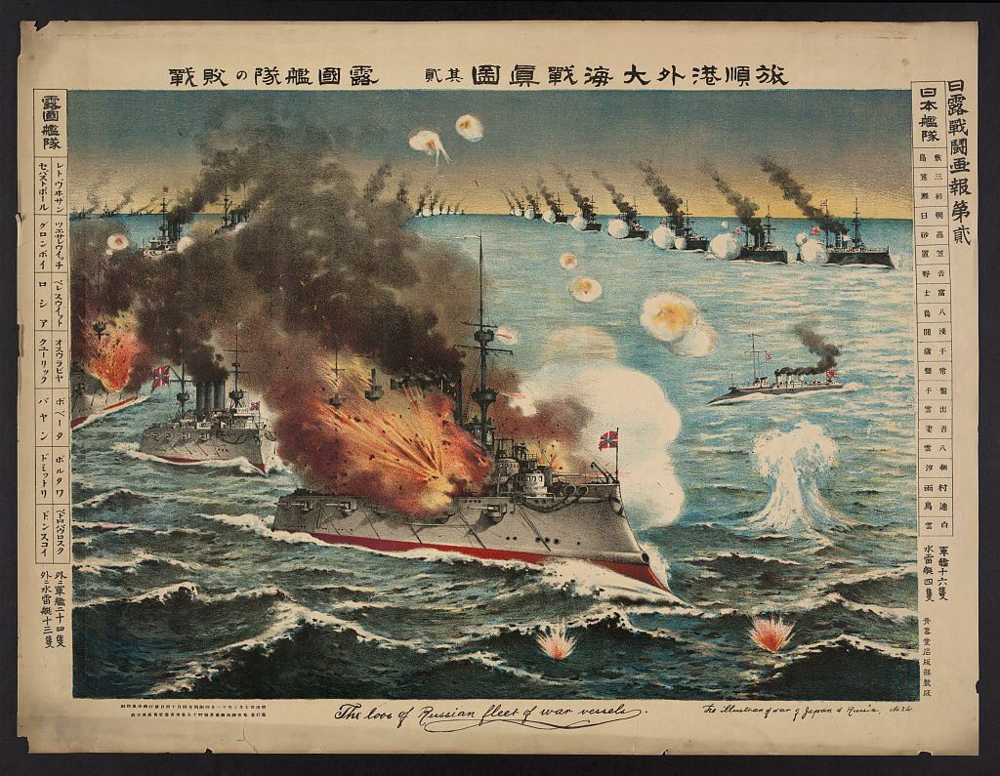
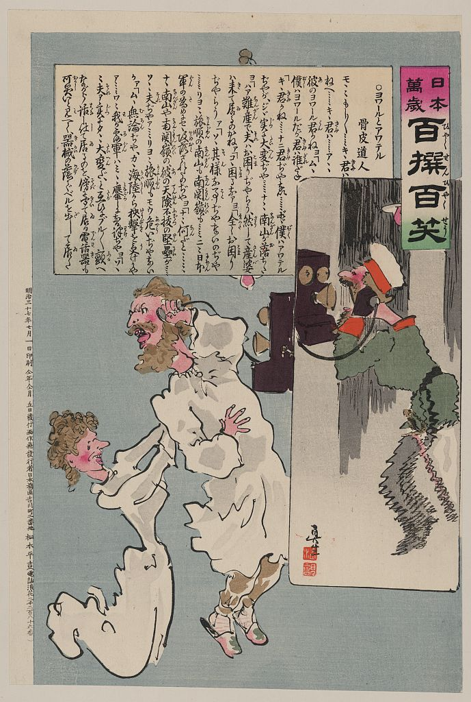
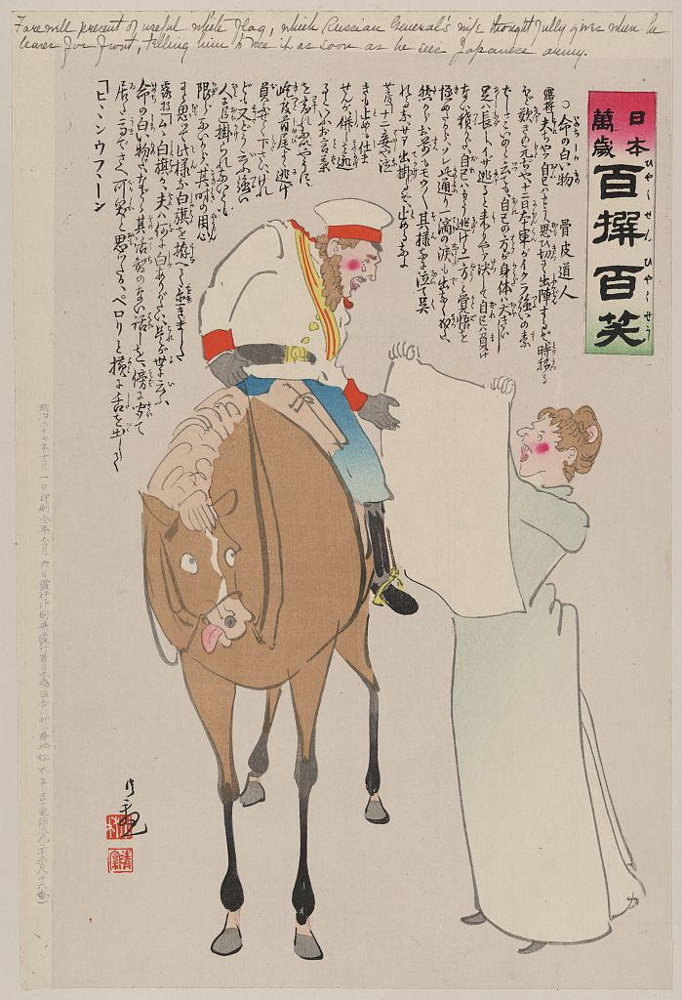

## Before Tsushima

The Russo-Japanese War began in February of 1904 when the Japanese Navy attacked a Russian Naval Fleet at Port Arthur. Both sides scaled up their operations to prepare for the war, but Russian force suffered greatly from the death of one of their key Admirals, Admiral Stepan Makarov. 

Falling behind, Russia decided to deploy a second Squadron, which they called the Second Pacific Squadron. Containing almost a dozen battleships and multiple divisions of their Fleet, the Squadron started to head to the far east, hoping to join the first Squadron. The fleet mistakenly fired at and killed British fishers in the North Sea, thinking they were Japanese boats, which almost brought Britain into the war, however France intervened and convinced Britain to stay out.

Continuing the journey to the far east, the Second Pacific Squadron sailed around Africa, and stopped at Madagascar. The long journey was a difficult one, with a constant struggle of obtaining fuel, taking a toll on the crew and lowering morale. 

Following the Siege of Port Arthur, one of the most violent battles of the war, the Second Pacific Squadron headed from Madagascar to Vladivostok to join the rest of the fleet. As this was following an extremely long journey, the Russian fleet had deteriorated significantly, leaving it in an unfavorable condition. The Second Squadron sailed through the Tsushima Strait on this journey, which is where a Japanese cruiser spotted them. Radio messages kept the Japanese Captains connected, however they were intercepted by the Russians and therefore alerted the Russians that they had been spotted. Both sides then began to prepare for battle.

## Aftermath of Tsushima

Following the Battle of Tsushima and with the loss of their greatest fleet, Russian public opinion quickly turned against the ruling Romanov dynasty and the Russo-Japanese war in general. The Russian forces had lost nearly their entire squadron, while the Japanese fleet suffered relatively minor losses (losing only three torpedo boats and taking heavy damage on their battleships). The Russians lost nearly five thousand men to Japan’s one hundred. Notably, the Baltic Fleet’s *Oslyabya*, pictured above, was the **first modern battleship to be sunk by gunfire alone**: fitting as steel battleships supplanted the older wooden ships of the past.

The overwhelming Japanese success caused certain immediate geopolitical shifts. Captain Pakenham of the British Navy, an observer on the Japanese side of the battle, noted that the longer range and faster speed of Japanese battleships were decisive in victory. In a few years, the British would build the *HMS Dreadnought*, defining battleship doctrine in the early twentieth century. While the defeated Russian fleet was built for close action, having a mixture of six-inch, ten-inch, and twelve-inch guns, the HMS Dreadnought focused on packing as many large guns on the vessel as possible for the longest range, with steam turbines to propel it as fast as possible. The vessel’s name, “fear nothing,” was an apt summary of the British plan to level any enemies in its path. Germany, threatened by this new development, began building dreadnoughts as well, leading to an **arms race** that would set the stage for the **first world war**.

The Japanese public reacted with jubilation to the victory. Notably, as evidenced by the wood carvings included on the right, political cartoonists had a field day with the battle, showing that **they had proved their worth as equals to the west.** At top right, a Russian battleship is hit by the Japanese -- note that the Japanese ships are shown as unhit. At middle right, the admiral who surrendered at Tsushima quakes as he calls a caricature of the Tsar. At bottom right, the wife of a Russian general hands her husband a white flag as a weapon and tells him to use it as soon as possible once they encounter the enemy.

It is notable that the Japanese public potentially could have overshot their success. For one, the concept of the **Yellow Peril was heightened by their victory**, causing Western powers to be cautious in future wars. The original essay stated, “Le «péril jaune» est signalé de toutes parts. Les Chinois sont quatre cents millions. Théoriquement ils peuvent mettre trente millions d'hommes sur pied de guerre. Un beau matin, ils devaient envahir l'Europe, massacrer ses habitants et mettre fin à la civilisation occidentale,” which can be roughly translated as “The Chinese have 400 million citizens: theoretically, they raise an army of thirty million. One beautiful morning, they invade Europe, massacre their inhabitants, and finish Western civilization.” Kaiser Wilhelm II notably promoted this ideology for his own gain, arguing that the Japanese victory in Tsushima, coupled with an alliance with Chinese manpower, would spell the end for the West.

Additionally, the Japanese (and Western forces alike) placed heavy **emphasis on the equipment** bringing victory. Notably, it was said that while the Russians sold their lives bravely, it was “to no avail,” according to a report from the Washington Times. The Japanese would continue to build more and larger battleships and continue a more aggressive tack for building an empire, potentially contributing to their eventual defeat in the second world war. On another note, Isoroku Yamamoto participated in Tsushima, losing two fingers from a shell he was loading into an eight-inch gun. His experiences at Tsushima would inform him later as a commander in the Second World War (below, the wreck of a Russian ship in now-Japanese Port Arthur).

**The Russian Government was portrayed as incompetent in global opinion.** Britain, in particular, celebrated the defeat, as their own civilian ships had been sunk by Russian battleships who mistook the ships for Japanese cruisers, leading to severe diplomatic fallout and poor public opinion of Russia. In a translated account from a Russian sailor, the English translator noted that while the account was negative on the subject of Britain, “\[he\] has ably exposed the corruptibility of the Russian Government and its inability to cope with the great needs which were demanded of it.” Similar sentiments were reflected in primary sources of the era such as American Newspapers.

## Sources
